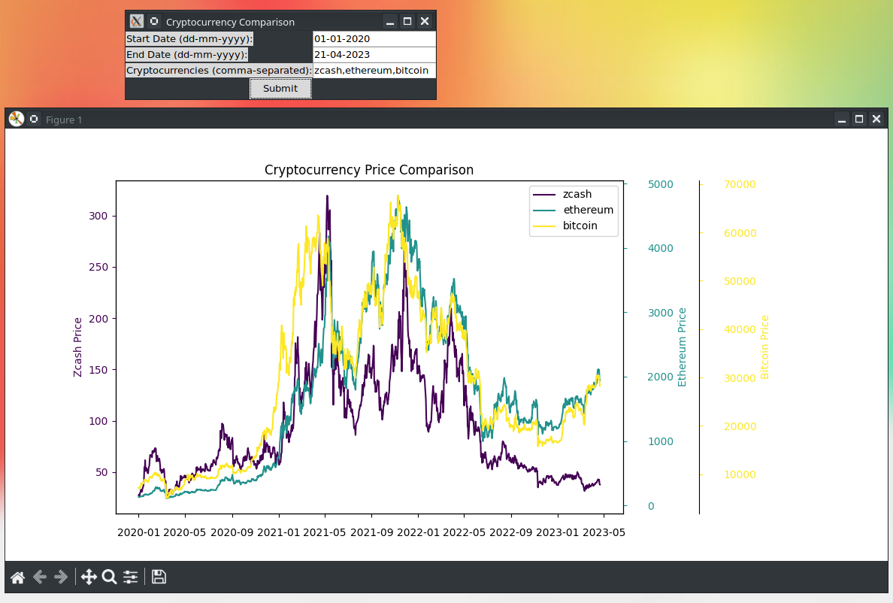

# CoinCorrView: Cryptocurrency Correlation Visualization Tool

CoinCorrView is a user-friendly tool for visualizing the price correlation between different cryptocurrencies. By entering the desired date range and cryptocurrencies, users can observe how the prices of multiple cryptocurrencies have moved in relation to each other. With CoinCorrView, you can easily visualize multiple charts at the same time to compare the price correlation between different sets of cryptocurrencies. This tool leverages the [CoinGecko API](https://www.coingecko.com/api/documentation) to fetch historical price data for the selected cryptocurrencies.

## Features

- User-friendly interface for entering date range and cryptocurrencies.
- Visualize price correlations between multiple cryptocurrencies.
- Ability to display multiple charts at the same time to compare different sets of cryptocurrencies.
- Powered by the CoinGecko API for reliable and accurate data.

## Dependencies

- Python 3
- Requests
- Pandas
- Matplotlib
- NumPy
- Tkinter

## Usage

1. Clone the repository:

`git clone https://github.com/cpte-org/CoinCorrView.git`

2. Install the required dependencies:

`pip install -r requirements.txt`

3. Run the `main.py` script:

`python main.py`

4. Enter the desired date range and a comma-separated list of cryptocurrencies, then click "Submit" to visualize the correlations.

## Legal

This project uses the CoinGecko API. By using this tool, you agree to CoinGecko's [Terms of Service](https://www.coingecko.com/terms).

## License

This project is licensed under the MIT License. See the [LICENSE](LICENSE) file for details.
